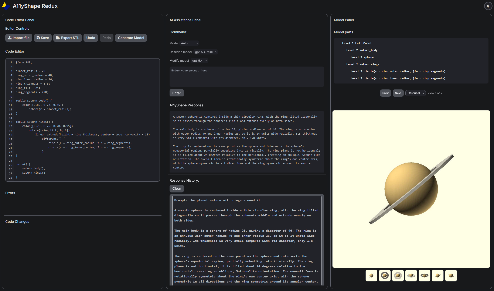

# A11yShape



A11yShape is an LLM-powered 3D modeling web interface designed to support visually impaired users in creating and modifying OpenSCAD models through natural language.

## Changes made in this fork

This fork significantly expands the original project’s configurability, usability, accessibility, and observability.

### Backend

- Refactored backend configuration to load API keys and model definitions from `.env` instead of hardcoded authorization headers
- Added support for an OpenAI-compatible API base URL override for third-party providers
- Added support for multiple describe/modify models via comma-separated `.env` values
- Added `/api/models` endpoint so the frontend can query available model options dynamically
- Updated request handling so selected describe/modify models are passed through from the UI to the backend
- Improved JSON parsing and change-detection handling for more robust LLM response processing
- Updated `requirements.txt` to use a newer Flask version and avoid dependency issues with deprecated Jinja2 versions

### Interface

- Reworked styling to use responsive CSS rather than per-element inline styling
- Added a manual describe/modify mode switcher, while preserving an automatic default mode
- Added Describe and Modify model dropdowns so users can select among configured LLMs at runtime
- Added an empty-editor fast path: if no model is currently loaded, modification requests can generate new OpenSCAD directly into the editor
- Added an image viewer with carousel/tile access to all rendered model views
- Added light/dark mode toggle
- Improved editor styling, including line-height and scrollbar behavior
- Updated favicon and image asset paths under `static/img`

### Accessibility

- Added automatic prerequisite installation scripts for Windows and macOS
- Increased verbosity and usefulness of errors shown in the UI error panel
- Improved handling and surfacing of OpenSCAD errors by returning stderr details when available
- Improved failure handling for rendering and generation steps so issues are surfaced more clearly to users

### AI pipeline

- Removed hardcoded OpenSCAD code responses to certain prompts that bypassed the LLM generation pipeline
- Added deduplication of rendered images across viewpoints using SHA-256 hashes before uploading them to the LLM, reducing unnecessary token usage
- Updated default models to newer GPT-5.4 variants
- Added support for separate configurable model pools for describe and modify workflows
- Improved prompting for describe/modify modes for better adherence and output quality
- Disabled streaming for LLM calls in favor of more controlled request handling and logging
- Added model-aware request routing so the selected frontend model is used for generation

### Logging and diagnostics

- Added extensive timing and diagnostic logging around key routes such as image generation and describe/modify requests
- Improved logging of pipeline stages, warnings, failures, and performance data to `log.txt`
- Added more informative warnings for LLM failures, render failures, and malformed responses
- Improved backend error propagation so API responses can include details such as `codeError` when rendering fails
- Expanded API responses and backend logging for easier debugging and development

## Setup

1. Clone the repository to a local folder.
2. Run `setup_windows.bat` (Windows) or `setup_macos.sh` (macOS) to install Python, OpenSCAD (if not already installed and available in `PATH`), and project dependencies via `pip`.
3. Rename `.env.example` to `.env`.
4. Set `OPENAI_API_KEY` to your OpenAI API key.

   - If you are using a third-party model provider, set `OPENAI_BASE_URL` to that provider’s OpenAI-compatible base URL and use your provider token as `OPENAI_API_KEY`.
   - You can configure multiple models for describe/modify tasks using comma-separated model lists in the environment file.

5. Run the app with:

   ```bash
   python app.py
   ```

6. Open <http://localhost:3000/> in your browser if it does not open automatically.

## Notes

- This fork supports selecting different models for describe and modify workflows directly from the UI.
- If the editor is empty, modify requests can bootstrap a new model from scratch instead of requiring an existing OpenSCAD file.
- Render and generation failures now provide more detailed diagnostics to help with debugging.
